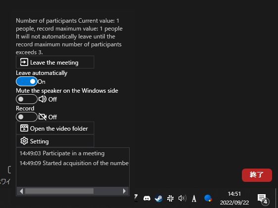

# ZoomCloser

Windows software that prevents you from forgetting to leave the Zoom meeting.

## Installation

[Releases](https://github.com/34j/ZoomCloser/releases)  
Download the latest release from Releases. Once the program is started, it registers itself in the startup and automatically starts the next time the computer is started.
To stop this automatic startup, disable the program's startup from the Task Manager.

## Requirements

-   .NET 6.0
-   Windows10.0.17763.0 x64

## Features

-   Get the number of participants in the Zoom meeting. Simulates the keyboard input of the default "Leave Meeting" shortcut key "Alt + Q → Enter" when the number of participants falls below "Maximum number of participants \* a certain percentage".
-   Mute the meeting audio with a Windows feature (instead of a Zoom feature).
-   Record the meeting.
-   Record the time you joined the meeting and the time you left the meeting.
-   Multilingual support (English, Chinese, Spanish, Hindi, French, Russian, Japanese, Korean, etc.)

## License notes

Note that the code in this repository is MIT licensed, but some dependencies are not MIT licensed.
